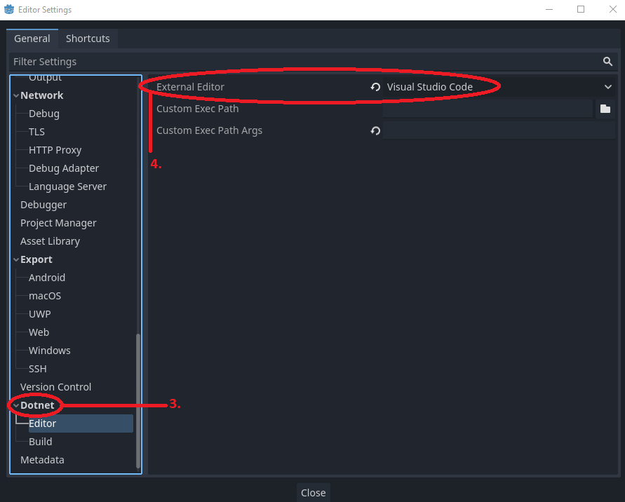

# Setting up VSCode in Godot
VS Code is not the default IDE of the Godot engine, to change it do the following:

1. Open a project in the Godot launcher
2. In the top menu, select Editor > Editor Settings
3. In the popup, look for Dotnet > External Editor
4. Change the "External Editor" property to **Visual Studio Code**

> Note: Godot checks the **default location** of VSCode when set this way. If you set your IDE somewhere weird, enter the path in the "Custom Exec Path" property instead.

Now when you open a C# file, Godot will open VSCode by default.